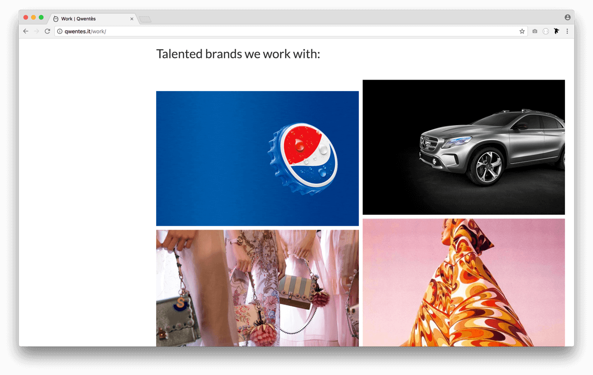
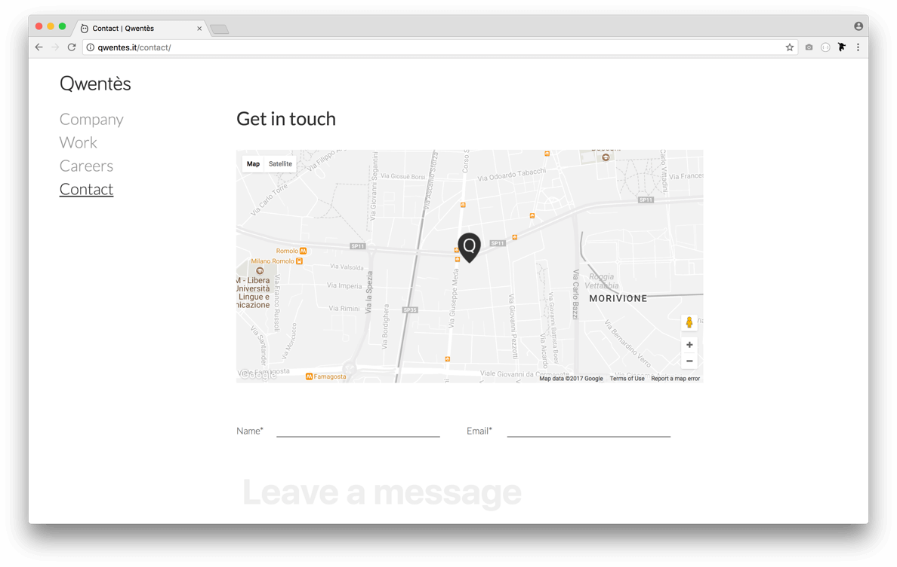
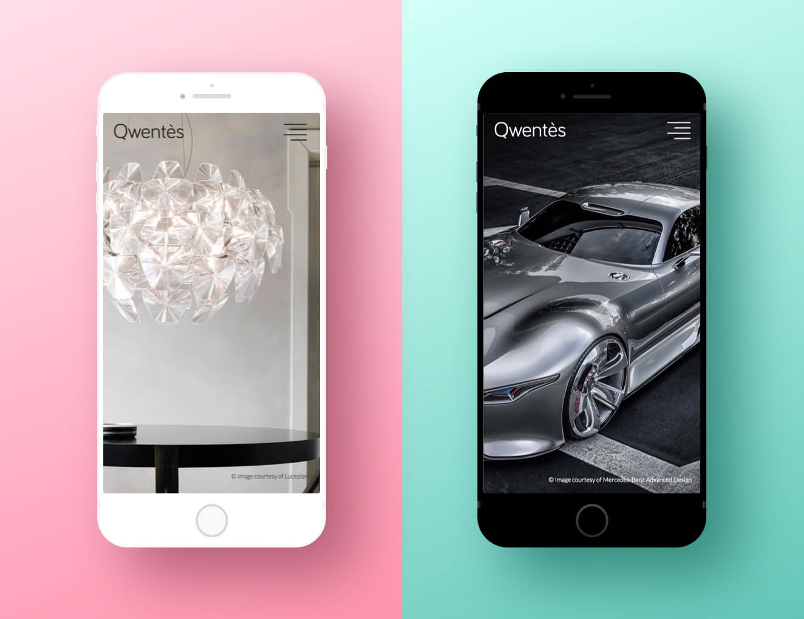

<h2>brief</h2>

The new qwentès website needed to be redesign with a more clean and fresh look

Big images, thin font-weight and white spaces have been used to give the right balance between visual impact and usability

<h2>technologies</h2>

The development was done with <a href="https://jekyllrb.com/">jekyll</a>, a static site generator that help the developer to build faster the pages

The main content of the website is the homepage, that shows a full page slider with images that represents the main clients of the agency

The slider includes a script that adapts the colour of the text based on the background of the image, to have almost always a good legibility

