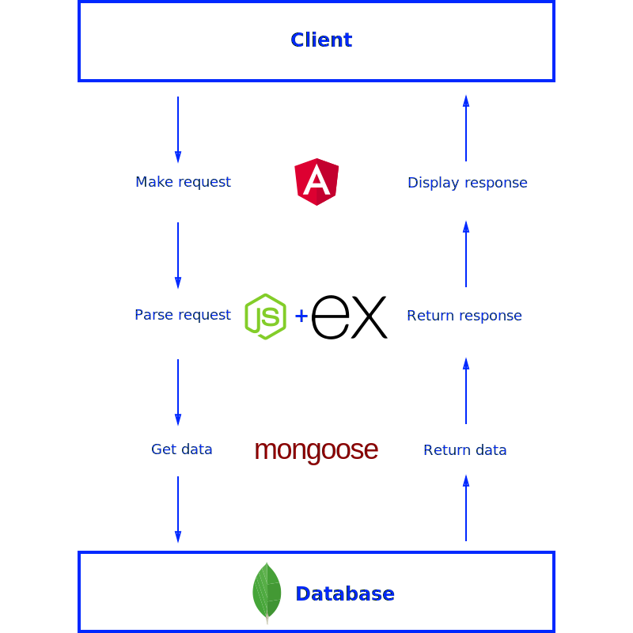

<h2>brief</h2>

We had the necessity to create a configurator to filter down data and reach a result of one or more configurations from a dataset

<h2>technologies</h2>

We decide to develop the whole project in javascript, to explore the powerful tools that this language can give to developers

The project has three main parts: a javascript component, an admin panel and both call a set of API

The component and the admin are angular applications, while the API are developed in nodejs

<h2>typescript + node + express + mongoDB</h2>

We used expressjs as node framework, flexible and minimal, and mongoDB with mongoose to handle reading and writing operations on database.

The entire project was written and tested in typescript, and we follow an architecture structure divided in:

- Routes

- Controllers

- Use Cases

- Services
