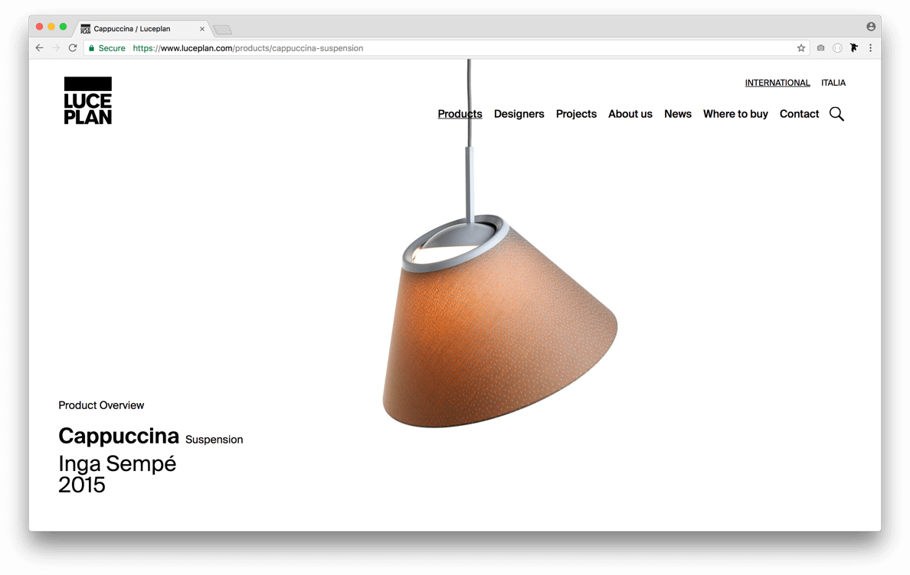

<h2>links</h2>
- [luceplan.com](https://www.luceplan.com/)

<h2>brief</h2>

Luceplan asked to redesign their website with a new and contemporary look.

The project had to be ready for the <b>salone del mobile 2017</b>, where luceplan was one of the main brands of <b>euroluce</b>, international exhibition of light and lamp design.

<h2>technologies</h2>

The peculiarity of this project was the CMS used: <a href="https://statamic.com/">statamic</a> is a flat CMS, based on files and not in DB.

Is dynamic, but can behave as a static website, using a sophisticated method of caching, to make the app become faster and performing.

<h2>output</h2>

The project started from the organisation of the contents, grouping them in macro areas, building the real website structure. From here we develop the UX.

Following the guidelines given from CCRZ, a swiss graphic design studio, we built the site with a fresher and cleaner look and feel, very photographic style, using beautiful photos of luceplan products.

Finally we implemented the SEO strategy and analytics, to optimise the website in google ranks.

