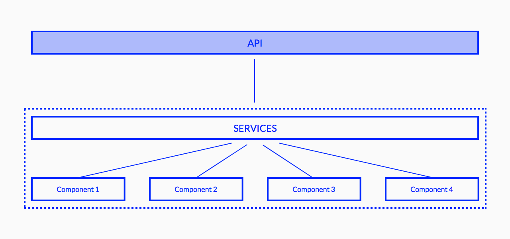

<h2>links</h2>
 - [documentation](http://hotels-booking-engine.qwentes.it/documentation)
 
 - [implementation](https://hotelgabrielparis.me)
 
<h2>brief</h2>

Suite of web components that allow the user to follow a flow to book an hotel reservation

This components consume a REST API service made by another company, that provide all the necessary data for all the funnel

<h2>technology</h2>

Web components are made using the <a href="https://www.webcomponents.org/">web components</a> technology, that today is supported in all modern browsers

To generate the components we used a framework call <a href="https://stenciljs.com/">stenciljs</a>, from ionic team, that has a well done build system and treeshaking, and can help with some polyfills for the legacy browsers such as IE11

The components do not reach directly the API, but there is another layer of JS services between them and the backend, ensuring DRY code and reusability

The services are made using streams, with RxJS and observables, a good way to share the data.

<h2>goal</h2>

The main goal of this project is to share the components in more frontend context

They can be imported in every project, without depends in any framework or library, they simply work with a basic configuration

Components are made to be customizable and flexible with some input, and they support the multilanguage

<h2>Main components</h2>
- <b>room list</b>: list of rooms with relative prices

- <b>room detail:</b> specific room with all details and prices for different rates

- <b>room rate:</b> detail of prices and sell conditions

- <b>calendar picker:</b> calendar with booking dates

- <b>guest picker:</b> selector for the number of the guests

- <b>basket:</b> summary of what the user has in cart

- <b>extra list:</b> list of possible extra to include in the reservation

- <b>customer detail form:</b> form of conclusion for the booking funnel
